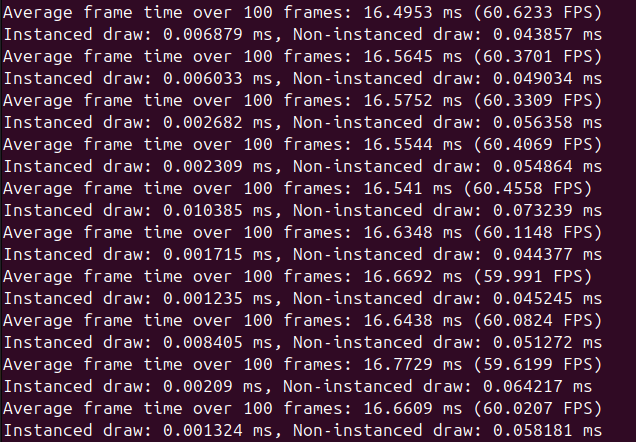

# 3D graphics @ UCU homework

**Name/Surname**: Matvii Shumylovych

**API**: OpenGL

**Late days**: 0/7

## How to build

To build, just do

```sh
cmake -B build
cmake --build build
```

## HW1

#### Basic features
window\
cube\
Euler Camera controlled by mouse + keyboard\
shaders to devide cube sides
#### Additional Features
cube moves in circle and rotates on axis
## HW2

#### Basic features
1000 instanced cubes\
3d model with textures\
floor with texture

Here is a result of runing program with 1000 cubes (no modell) 
\
So what can we see?\
As i interpret, first of all we got the 60 FPS in less than 16.6(alsmost expect some)\
we can see how much faster it is to use instancing and reason is quite obvious, we draw cube only once, without it the more cubes we have the more time we spend drawing them which in sum will make huge difference
#### Additional Features

## HW3

#### Basic features

#### Additional Features

## HW4

#### Basic features

#### Additional Features

## HW5

#### Basic features

#### Additional Features
