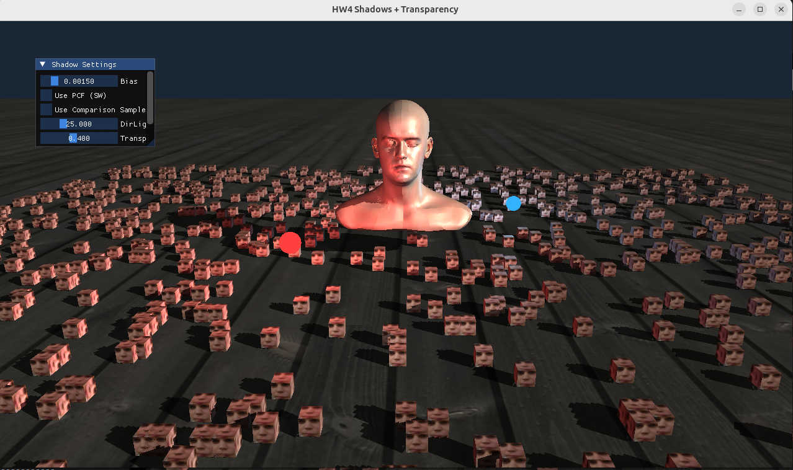
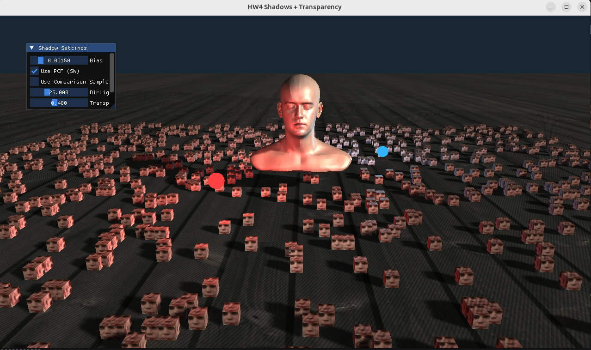
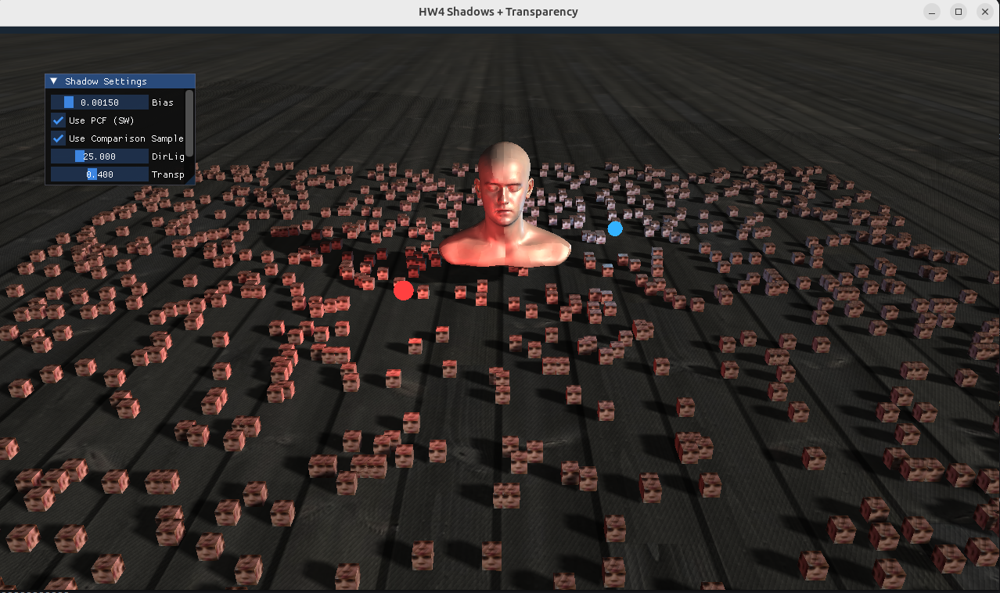
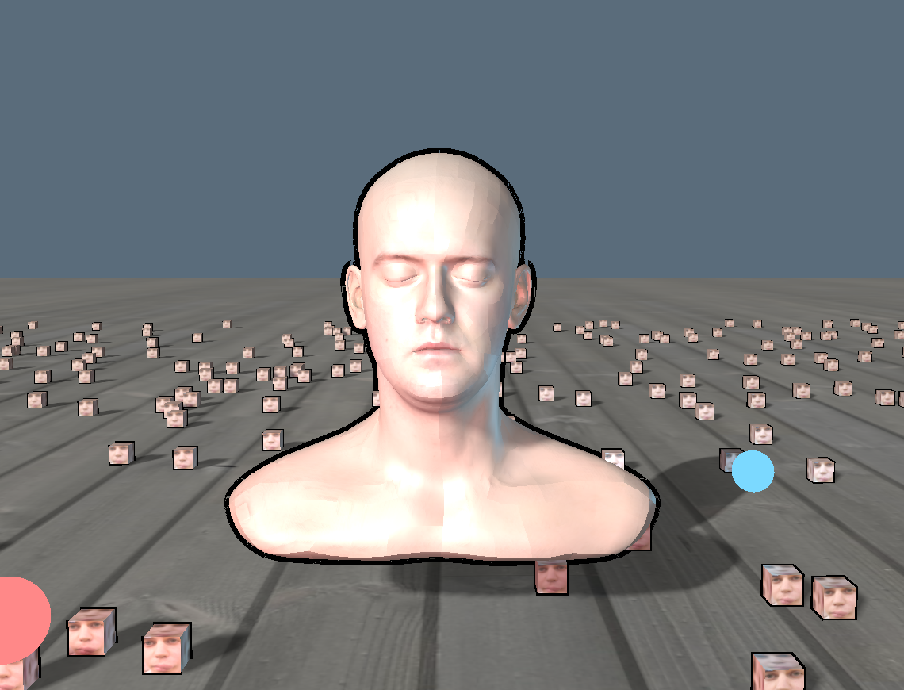
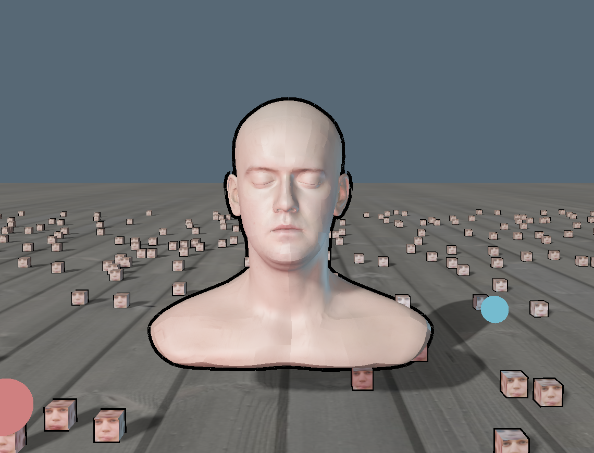
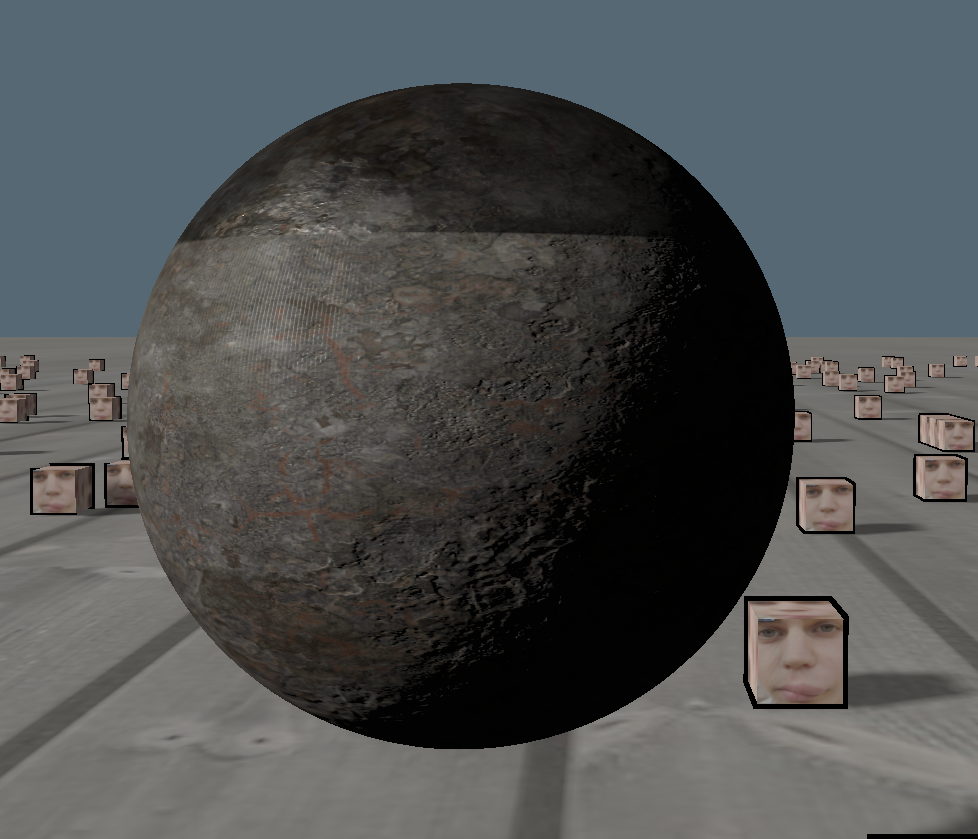
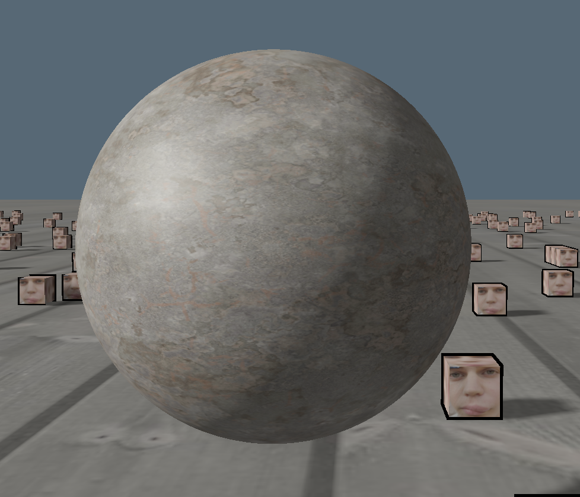
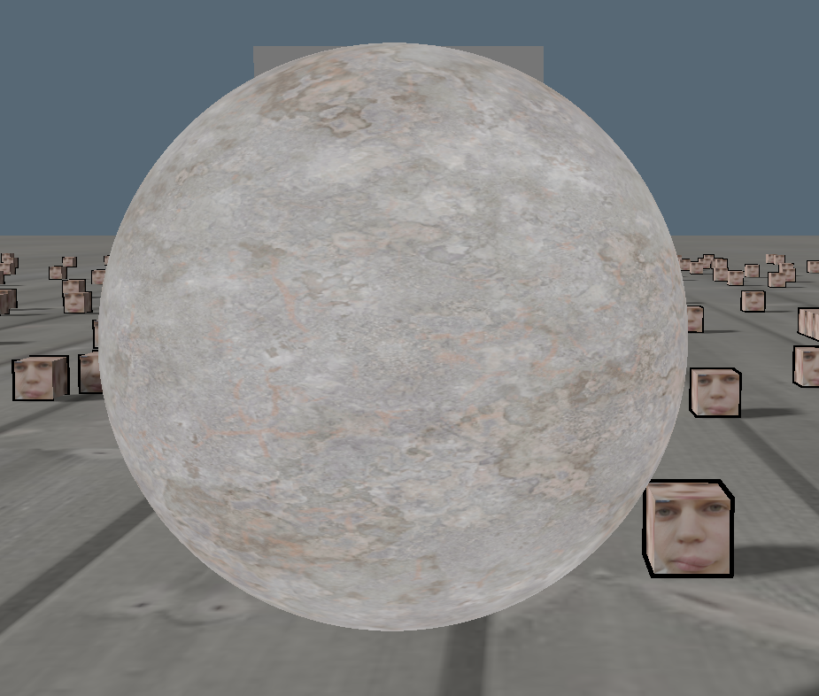
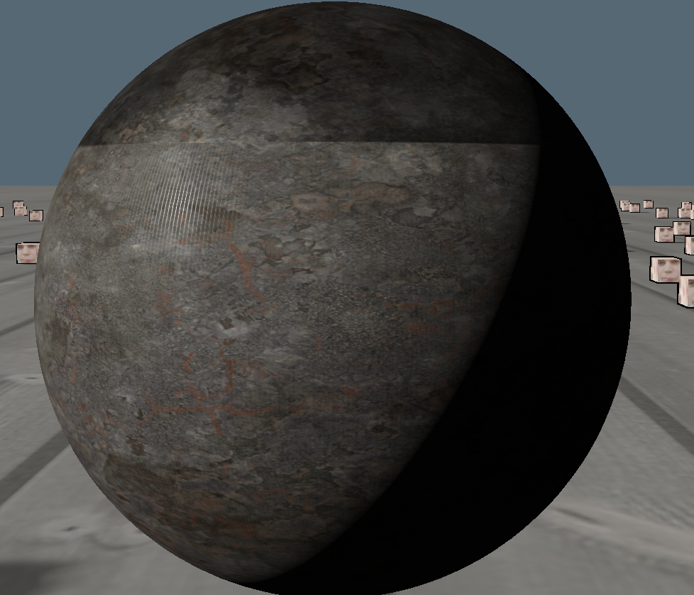
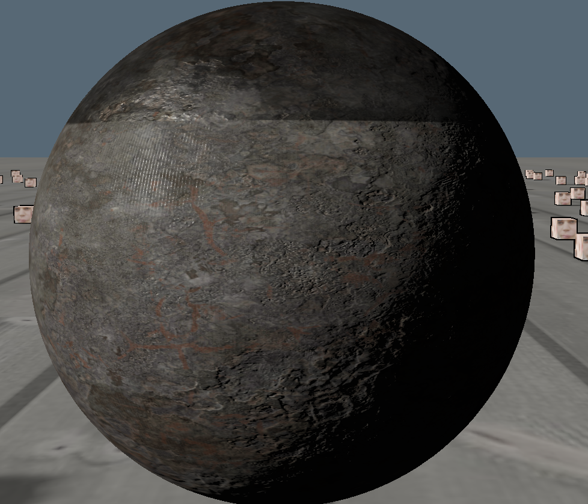

# 3D graphics @ UCU homework

**Name/Surname**: Matvii Shumylovych

**API**: OpenGL

**Late days**: 1/7

## How to build

To build, just do

```sh
cmake -B build
cmake --build build
```

## HW1

#### Basic features
window\
cube\
Euler Camera controlled by mouse + keyboard\
shaders to devide cube sides
#### Additional Features
cube moves in circle and rotates on axis
## HW2

#### Basic features
1000 instanced cubes\
3d model with textures\
floor with texture

Here is a result of runing program with 1000 cubes (no modell) 
\
So what can we see?\
As i interpret, first of all we got the 60 FPS in less than 16.6(alsmost expect some)\
we can see how much faster it is to use instancing and reason is quite obvious, we draw cube only once, without it the more cubes we have the more time we spend drawing them which in sum will make huge difference
#### Additional Features

## HW3
Fixed textures in hw2 and put code into .cpp files instead of .h
#### Basic features
3 light sources, directional light, point light, and spotlight\
blinn phong lighting system\
cleaned comments and old code
#### Additional Features

## HW4
Added absolute path using cmake for any pc since it was hard to check my homeworks 

#### Basic features
Added shadow rendering for directional light\
Added comparison sampling and SW PCF\
No PCF, No Comparison sampler\
\
PCF, No COmparison sampler\
\
No PCF, COmparison sampler\
\
PCF, Comparison Sampler\
\
Added  ImGUI\
Added a slider there that controls bias for the shadow acne avoidance\
Added transparent meshes
#### Additional Features
Added sliders to setup directional light for better use\

## HW5

#### Basic features
Added Exposure Tone Mapping algorithm to map HDR values to LDR screen output.\
Added Gamma Correction (sRGB) in the final post-processing stage.\
Added ImGui to turn on/off HDR\
- Added Material Inputs: the engine supports the Metal/Roughness:
    - Albedo: Base color (linearized).
    - Normal: High-frequency surface detail.
    - Metallic: Distinguishes between non-metal and metal surfaces.
    - Roughness: Determines smooth vs rough reflections.

Added Normal Mapping.\
Added Procedural Geometry(For sphere).\
Added the ability to switch shading models via ImGui.

#### Comparison
I did compared without toon shadowing, you can see the change better without it\

**No Tone Mapping** \
High intensity lights cause color values to exceed 1.0, which are clamped to white. Details in bright areas are lost completely.


**With Tone Mapping** \
High intensity values are compressed smoothly into the visible range. Details in bright spots are preserved, and lighting looks more natural.


**PBR**\
I have no idea what is that dark thing, it is not acne


**Blinn-Phong**\


**Emissive**\
I have no idea what that rectangle is

**No Normal Mapping** \
The sphere looks like a smooth ball with a flat texture pasted on it.\


**With Normal Mapping** \
The rust appears to eat into the metal, and the surface reacts to light direction with self-shadowing.\

#### Additional Features
Redone sphere rendering for the new model on which I tested PBR
## Project

#### Basic features
Implemented toon shading and cell shaling